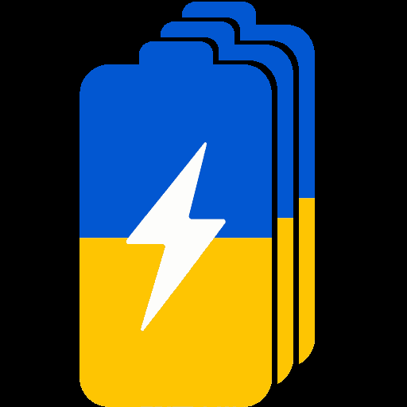

# BattDeck



**BattDeck** is an Android app for tracking UAV battery packs.

Its purpose is simple: quickly show which batteries are charged, which pack is active, which packs have already been used, and the order in which they should be selected.

BattDeck is not an ERP system or a cloud platform. It is a compact offline tool designed for fast field use.

The app is fully offline and local-first. Data stays on the device; manual JSON import and export through Android's system document picker and share sheet are available for moving data between devices.

## Download

Download the latest APK from [GitHub Releases](https://github.com/zarant77/batt-deck/releases/latest).

Direct APK download:

[](https://github.com/zarant77/batt-deck/releases/latest/download/BattDeck-release.apk)

## Features

- battery pack list;
- custom pack names;
- editable markings and colors;
- current voltage;
- charge percentage calculated from the voltage range;
- last charge update date;
- optional active battery state;
- gesture-based charge editing;
- swipe activation and deactivation;
- drag-and-drop ordering of ready packs;
- local JSON import and export.

## Stack

- Kotlin;
- Jetpack Compose;
- Material 3;
- local JSON storage with Android `AtomicFile`;
- Coroutines, StateFlow, and ViewModel.

## Documentation

- [Purpose](docs/PURPOSE.md)
- [Product Specification](docs/PRODUCT_SPEC.md)
- [User Interface](docs/UI_SPEC.md)
- [Data Model](docs/DATA_MODEL.md)
- [Battery Rules](docs/BATTERY_RULES.md)
- [Architecture](docs/ARCHITECTURE.md)
- [Project Structure](docs/STRUCTURE.md)
- [Roadmap](docs/ROADMAP.md)
- [Codex Notes](docs/CODEX_NOTES.md)
- [Custom F-Droid Repository](docs/FDROID_REPO.md)

## Product principle

The app must remain fast, simple, offline, and understandable at a glance. An operator should be able to open it, review battery state, and select the correct pack without navigating a complex workflow.

## Privacy

BattDeck does not use:

- accounts or authentication;
- the internet or a remote server;
- cloud synchronization;
- analytics or tracking SDKs;
- advertising or in-app purchases.

The app does not request `INTERNET`, broad storage permissions, or access to the installed-app list. Operational data remains in private Android storage until the user explicitly exports a JSON file.

## Build and run

Android Studio or JDK 17 with Android SDK 35 is required.

The simplest workflow uses the interactive runner:

```bash
./runner.sh
```

Commands can also be run directly:

```bash
./runner.sh doctor      # check the environment and device connection
./runner.sh build-run   # build, install, and launch on a connected device
./runner.sh release     # build signed release APK and AAB into build/
./runner.sh fdroid      # build and update the custom F-Droid repository
./runner.sh icons       # regenerate Android and F-Droid icons
./runner.sh test        # run unit tests
./runner.sh clean       # clean build outputs
./runner.sh deep-clean  # also remove local Gradle state
./runner.sh help        # list every command
```

Enable **Developer options → USB debugging** on the phone and authorize the computer. If several devices are connected, the runner asks which one to use.

Direct Gradle commands:

```bash
./gradlew assembleDebug
./gradlew assembleRelease
./gradlew test
```

The debug APK is created under `app/build/outputs/apk/debug/`. Without `keystore.properties`, the release command creates an unsigned APK suitable for F-Droid signing. The app supports Android 7.0 and later.

### Personal release signing

Personal release APK and AAB files use `keystore/battdeck-upload.jks`. Copy the local template and fill in the real key details:

```bash
cp keystore.properties.example keystore.properties
```

Set `storePassword`, `keyAlias`, and `keyPassword`, then run `./runner.sh release`. Both `keystore.properties` and keystore files are excluded from Git. Signed outputs are copied to `build/BattDeck-release.apk` and `build/BattDeck-release.aab`.

## Distribution

Signed APKs may be distributed directly through GitHub Releases or another trusted channel. Users should verify the source and APK signature before installation.

The repository includes an F-Droid metadata draft at `metadata/com.catemup.battdeck.yml` and localized descriptions under `fastlane/metadata/android/`. Inclusion in the official F-Droid catalog still requires a public tag, an accessible source archive, and a merge request to `fdroiddata`.

## F-Droid repository

BattDeck can be installed from the custom F-Droid repository:

```text
https://zarant77.github.io/batt-deck/fdroid/repo/
```

See [docs/FDROID_REPO.md](docs/FDROID_REPO.md) for repository generation, signing, publishing, and client setup instructions.

## App icons

The root `icon.png` is the single source for Android launcher icons and the custom F-Droid repository icon. Install ImageMagick and regenerate all icons with:

```bash
brew install imagemagick
./runner.sh icons
```

## Implemented in v0.3.0

- five core screens with Ukrainian and English localization;
- atomic local persistence in a single JSON file;
- charge, marking, name, and update-date editing;
- swipe activation and drag-and-drop queue ordering;
- safe battery-count and voltage-range settings;
- portable JSON backup sharing without cloud services or accounts;
- signed release and custom F-Droid repository workflows.

## License

BattDeck is licensed under the Apache License 2.0. See [LICENSE](LICENSE).
