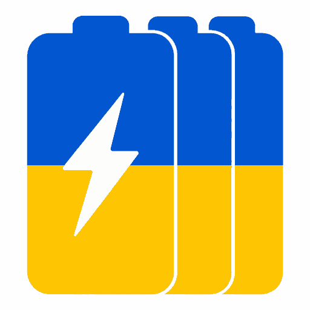

# BattDeck



**BattDeck** — Android-застосунок для обліку комплектів батарей БПЛА.

Мета проста: швидко бачити, які батареї заряджені, яка батарея зараз активна, які комплекти вже використані, і в якій черзі їх брати.

Це не складна ERP-система і не “розумний хмарний сервіс”. Це компактний офлайн-інструмент для бойового використання.

## Основна ідея

- список комплектів батарей;
- номер кожного комплекту;
- тип комплекту: синій або чорний;
- поточна напруга;
- відсоток заряду, розрахований зі шкали напруги;
- дата останньої зміни заряду;
- активна батарея;
- ручна зміна заряду;
- швидке скидання використаної батареї;
- зміна порядку черги.

## Стек

Базова рекомендація для нової версії:

- Kotlin;
- Jetpack Compose;
- локальний JSON-файл;
- Material 3 як технічна база, але з кастомним tactical/pixel UI.

## Документація

- [Purpose](docs/PURPOSE.md)
- [Product Specification](docs/PRODUCT_SPEC.md)
- [User Interface](docs/UI_SPEC.md)
- [Data Model](docs/DATA_MODEL.md)
- [Battery Rules](docs/BATTERY_RULES.md)
- [Architecture](docs/ARCHITECTURE.md)
- [Project Structure](docs/STRUCTURE.md)
- [Roadmap](docs/ROADMAP.md)
- [Codex Notes](docs/CODEX_NOTES.md)

## Принцип

Застосунок має бути швидкий, простий, офлайн і зрозумілий з першого погляду.

Оператор не повинен думати, де що натискати. Відкрив — побачив стан батарей — взяв правильний комплект.

## Збірка і запуск

Потрібні Android Studio з JDK 17 та Android SDK 35.

```bash
./gradlew assembleDebug
./gradlew test
```

Debug APK буде створено в `app/build/outputs/apk/debug/`. Для запуску відкрийте корінь репозиторію в Android Studio, дочекайтеся синхронізації Gradle та запустіть конфігурацію `app` на пристрої або емуляторі з Android 7.0 чи новішим.

## Реалізовано у v0.1.0

- пʼять MVP-екранів українською мовою;
- локальне збереження всіх даних в одному JSON-файлі;
- зміна заряду, типу й номера батареї;
- активація та скидання свайпами;
- безпечна зміна кількості комплектів і шкали напруги.

Зміна черги перетягуванням запланована на v0.2.
